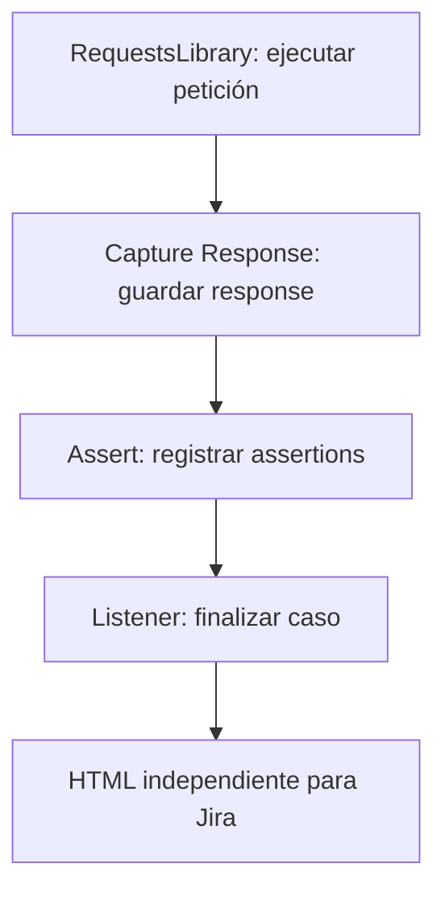

## Capture. Validate. Share.

- **01 · Capture Response**

    Keep the HTTP exchange alongside its test case.

- **02 · Assert**

    Associate each validation with the corresponding request.

- **03 · HTML**

    Share a standalone report, ready to open offline.

## Requirements

| Tool | Compatibility |
| --- | --- |
| Python | 3.12+ |
| Robot Framework | 7.5+, within 7.x |
| RequestsLibrary | Executes HTTP; installed separately |
| DataDriver | Optional; generates cases from tabular data |

## How it works

Only explicitly captured exchanges are included. Importing the library registers its listener; no CLI listener argument or generation keyword is required.

!!! tip "Metadata is optional"
    Add environment, identifiers or row data for context. The report works without them or an additional title.

## Choose your route

- **First use:** [install](installation.md) and [run a case](usage.md).
- **Tabular data:** [generate DataDriver cases](datadriver.md).
- **Review results:** [read Summary, Failures and Assertions](report.md).
- **Check arguments:** [Libdoc reference](keywords/index.html).
- **Run the complete project:** [executable example](https://github.com/angel-valdezzz/robotframework-api-testing/tree/main), using Poetry and a fictitious local API.

You can also open a [passing report without metadata](examples/passing.html). Each example contains one case; there is no suite-wide dashboard.
