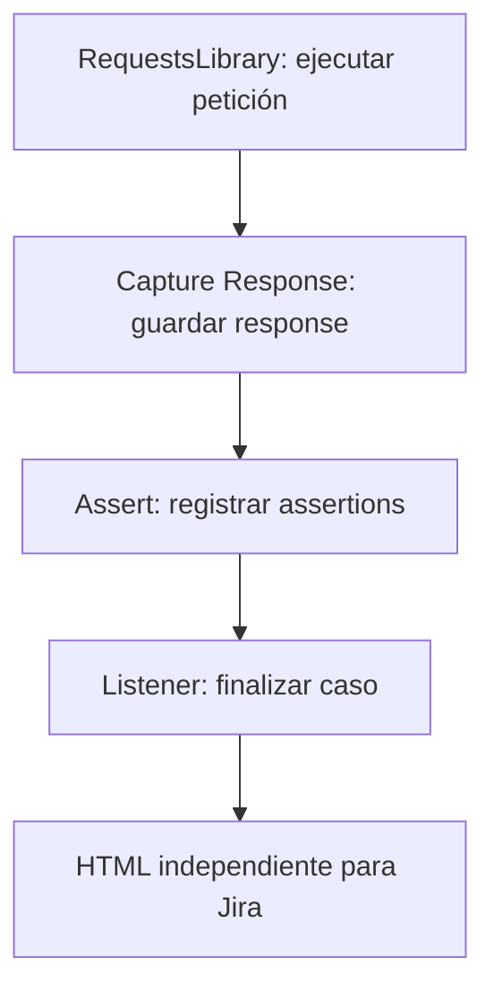

## Captura. Valida. Comparte.

- **01 · Capture Response**

    Conserva el intercambio HTTP junto a su caso de prueba.

- **02 · Assert**

    Asocia cada validación con su petición correspondiente.

- **03 · HTML**

    Comparte un reporte independiente, listo para abrir sin conexión.

## Qué necesitas

| Herramienta | Compatibilidad |
|---|---|
| Python | 3.12 o superior |
| Robot Framework | 7.5 o superior, rama 7.x |
| RequestsLibrary | Ejecuta las peticiones; se instala aparte |
| DataDriver | Opcional, genera los casos a partir de datos |

## Cómo funciona

Solo se incluyen los intercambios que capturas explícitamente. Importar la librería
registra su listener: no necesitas un argumento CLI ni una keyword de generación.

!!! tip "Los metadatos son opcionales"
    Puedes agregar entorno, identificador o fila de datos para dar contexto.
    El reporte funciona sin ellos y sin un título adicional.

## Elige tu recorrido

- **Primer uso:** [instalar](installation.md) y [ejecutar un caso](usage.md).
- **Datos tabulares:** [generar casos con DataDriver](datadriver.md).
- **Revisar resultados:** [leer Summary, Failures y Assertions](report.md).
- **Consultar argumentos:** [referencia Libdoc](keywords/index.html).
- **Probar el proyecto completo:** [ejemplo ejecutable](https://github.com/angel-valdezzz/robotframework-api-testing/tree/main), con Poetry y una API local ficticia.

También puedes abrir un [reporte aprobado sin metadatos](examples/passing.html). Cada ejemplo es un
archivo de un solo caso. No existe un dashboard que reúna toda la suite.
